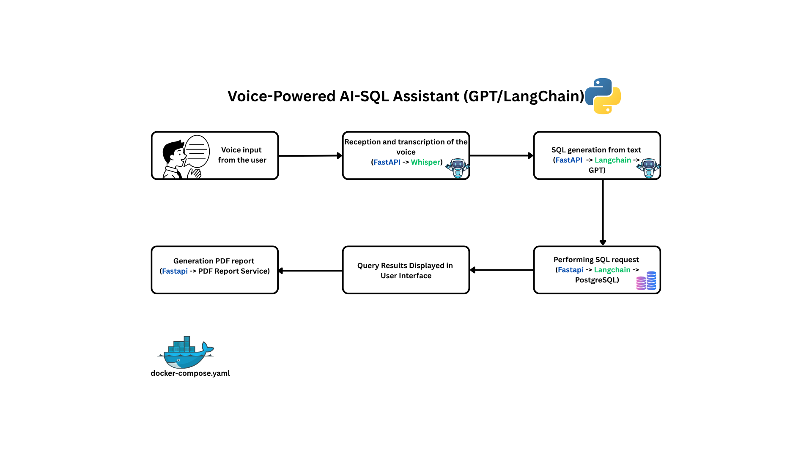
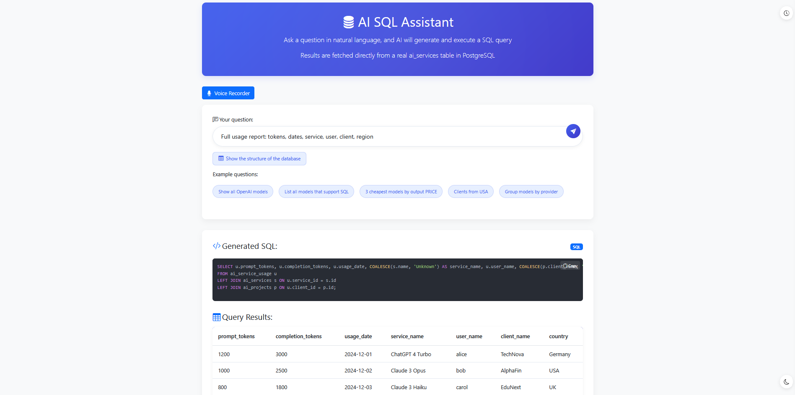
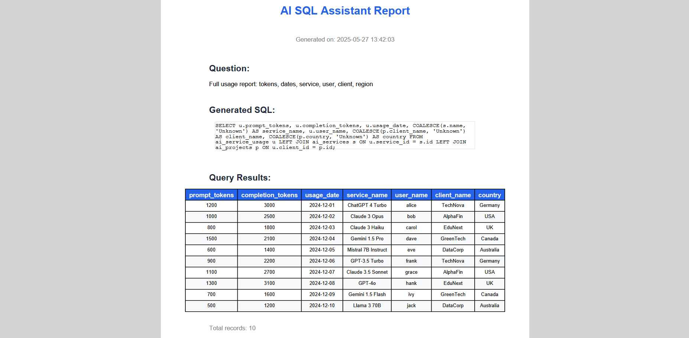

# Voice-Powered AI-SQL Assistant (Python/GPT/LangChain)

  
Ask a question with voice input, and AI will generate and execute a SQL query. The application is connected to `PostgreSQL`, which hosts several key tables, including `ai_services` (for AI model parameters like prices and providers), `ai_projects` (for project details, including client and country information), and `ai_service_usage` (for service usage metrics like token consumption)
Only SELECT requests are allowed
SUM, COUNT, AVG, JOINs, etc. are worked correctly

## 💡 Tech Stack

- Python
- FastAPI
- OpenAI Whisper for voice transcription
- PostgreSQL
- OpenAI GPT (gpt-4o)
- 🐳 Docker + Docker Compose

## Project Showcase




- 📂 Examples,Swagger screenshots, and results are located in the `media_examples/` folder

## ⚙️ Key Engineering Challenges

- **Natural Language to SQL Translation using LLMs and LangChain**  
  Leveraged LangChain with OpenAI's GPT models to accurately translate diverse user questions into executable SQL queries, based on the structure of the `ai_projects `, `ai_service_usage`, `ai_services` tables.

- **Dynamic SQL Execution with LangChain Executor**  
  Security measures within the `LangChainExecutor` to safely execute dynamically generated SQL, mitigating injection risks through validation and controlled database interactions.

- **Automated Database Initialization with Production Data**  
  Seamless setup by configuring the `PostgreSQL` container to automatically initialize the tables via `init.sql`.

- **Dockerized Multi-Container Deployment**  
  Orchestrated the `FastAPI Python application` and `PostgreSQL` database using Docker Compose, incorporating named volumes for persistent data storage and health checks to ensure reliable service startup and operation.

- **Flexible, Context-Aware LLM Prompting Pipeline**  
  Building the system using LangChain to effectively handle natural language queries, providing domain-specific context for accurate SQL generation and enabling easy adaptation to various database schemas.

## ✅ Testing

The Python backend is covered with both unit and integration tests for core logic components:

- Natural Language to SQL Translation
- SQL Execution Layer
- Query Safety Filters
- PDF Report Generation
- API Endpoints

## 🐳 How to Run

1. Open `docker-compose.yml` and update these environment variables:

- OPENAI_API_KEY: ${OPENAI_API_KEY}
- POSTGRES_DB: ${POSTGRES_DB}
- POSTGRES_USER: ${POSTGRES_USER}
- POSTGRES_PASSWORD: ${POSTGRES_PASSWORD}
-

2. Run everything with Docker Compose:

```bash
docker-compose up --build
```

3. Access service:
   - `http://127.0.0.1:8000/ask`
   - `http://127.0.0.1:8000/ask-voice`
   - `http://127.0.0.1:8000/download-report-pdf`
   - `http://127.0.0.1:8000/health`
   - `http://127.0.0.1:8000/docs` - for Swagger documentation

## ⚠️ Tech Notes

- This project uses the OpenAI API, but the architecture allows for easy integration with other LLM providers (e.g. Anthropic, Google, Cohere, Mistral) depending on business needs and cost model.

## 🤝 Thanks for your interest!

- I'm always open to feedback, collaboration, or professional connections.
- Feel free to reach out!
